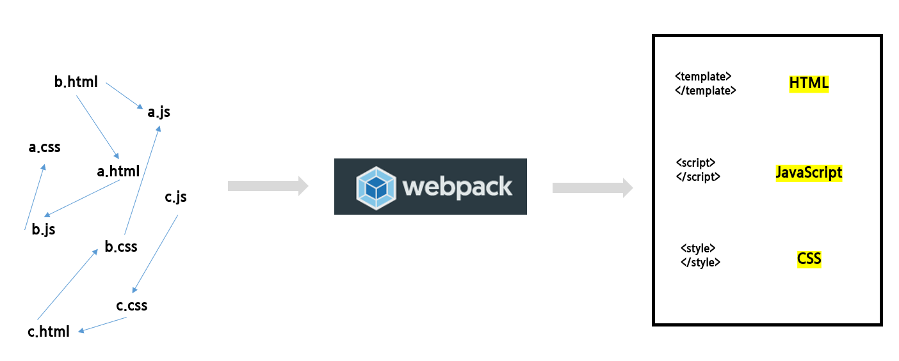

# 00_Vue CLI

> 2020.11.11 오전 라이브


## 1. Coding Style Guide

> "개발자에게는 코드가 얼굴이다."

https://kr.vuejs.org/v2/style-guide/index.html

- 개발을 할 때 코드 자체를 이해하는 것 만큼이나 중요한 건 일관된 스타일 가이드와 가독성이 높은 코드를 작성하는 것이다. 
- 항상 협업 가능성을 열어두고 어떤 사람이 봐도 읽기 좋은 코드를 작성하기 위한 노력을 해야 한다.
- 할 수 있지만 하면 안되는 것을 구분하고 조금 더 괜찮은 코드를 작성하기 위한 부분을 신경 쓰는 것은 개발자의 성장 가능성을 한층 더 높여준다.
- 다만, 무조건적으로 스타일 가이드를 따라가는 것보단 경험, 기술 스택 등을 충분히 고려하여 반영해야 한다.


## 2. SFC(Single File Component)

**컴포넌트**

> "다시 사용할 수 있는 범용성을 위해 개발된 소프트웨어 구성 요소를 일컫는다."

- Vue에서 컴포넌트는 재사용 가능한 코드를 의미하며 강력한 기능 중 하나이다.

- Vue 컴포넌트는 Vue 인스턴스다. (`new Vue({ ... })`)
- 주의해야 할 것은 `.vue`라는 확장자를 가진 파일 안에 작성되는 것만이 컴포넌트는 아니라는 점이다. 
  - 단지, SFC는 컴포넌트 기반의 개발을 편리하게 만들기 위해 webpack이라는 빌드 도구를 사용해 제공해주는 것이다. 
  - 단일한 `.html` 파일 안에서도 여러 개의 컴포넌트를 만들어 개발이 가능하다. (첫 날 진행한 내용에서 `.html` 파일에 `new Vue({ ... })` 코드가 얼마나 많이 쓰였는지 확인해보자)
  - 자세한 내용은 [공식 문서](https://kr.vuejs.org/v2/guide/components-registration.html)를 참고해보자.


**싱글 파일 컴포넌트(SFC)**

https://kr.vuejs.org/v2/guide/single-file-components.html

> "Webpack 같은 빌드 도구를 활용해 `.vue` 확장자를 가진 파일"

- 화면의 특정 영역(컴포넌트)에 대한 HTML, JavaScript, 그리고 CSS 코드를 하나의 파일(`.vue`)에서 관리
- Vue 컴포넌트는 Vue 인스턴스고 해당 요소는 `.vue` 확장자를 가진 파일 하나에서 관리한다.


## 3. Vue CLI(Command Line Interface)

<u>**"어떻게 컴포넌트 기반의 개발을 할 수 있을까?"**</u>


**node.js**

https://nodejs.org/ko/

- 라이언 달에 의해 2009년도에 출시된 JavaScript Runtime Environment
  - 새로운 환경은 '내 컴퓨터'에서도 JavaScript를 동작하게 만들 수 있다는 의미
  - 즉, 프로그래밍 언어가 동작하는 환경을 의미한다.
- 브라우저 위에서만 구동할 수 있었던 반쪽자리 언어 JavaScript로 Server Side Programming을 가능하게 되었다.

- 공식 문서에서 LTS(Long Term Support)로 설치한다. 장기적인 지원을 받고 있는 버전이기 때문에 안정성을 보장 받을 수 있다.

- node를 설치하면 npm은 자동으로 설치된다.

  ```bash
  # 설치 이후에 터미널에 아래의 명령어를 입력해보자
  $ node -v
  $ npm -v
  ```

  

**npm(node package manager)**

https://www.npmjs.com/

- node.js의 기본 패키지 관리자다. 파이썬의 pip와 동일한 역할을 수행한다.
- 대부분의 JavaScript 개발자가 활용한다.
- 우리가 사용하는 Vue.js 프레임워크도 npm을 활용해 환경을 구성할 수 있다.

- 공식 홈페이지에서 다양한 패키지를 검색해서 찾아볼 수 있다.


**Vue CLI**

https://cli.vuejs.org/

- CLI 환경에서 Vue.js 개발을 쉽게 할 수 있도록 만들어 주는 도구 

- npm을 활용해 설치한다.

  ```bash
  #1. 아래의 명령어로 설치하면 자동으로 vue가 설치된다.
  $ npm install -g @vue/cli
  
  #2. ver.Django
  $ pip install django
  ```

- 전역 영역에 vue cli를 설치 했다면 아래의 2개 명령어만으로 기본 개발 환경 구축이 끝난다.

  ```bash
  #1-1. my-project는 생성 할 프로젝트의 이름을 넣으면 된다.
  $ vue create my-project
  
  #1-2. ver.Django
  $ django-admin startproject crud .
  $ python manage.py startapp articles
  
  #2-1. 서버 실행
  # Vue.js는 Django와 다르게 기본 포트가 8080번이다.
  $ npm run serve
  
  #2-2. ver.Django
  $ python manage.py runserver
  ```


## 4. Babel & Webpack

> "JavaScript는 파편화와 표준화의 역사다. 학습 시에 이러한 배경 상황을 이해하고 접근하는 것이 중요하다."


Babel과 Webpack은 Node.js 환경으로 JavaScript의 개발을 빌드업 하는 경우에 매우 빈번하게 사용한다.

- 단, 초기 학습자가 활용하기에는 다소 어려운 측면이 있다. 
- 이번 시간에는 기본적으로 각 요소가 무엇을 의미하는지 파악하는 것에 집중해보자


어떠한 도구(언어, 프레임워크 포함)를 사용할 때는 아래와 같은 질문을 스스로에게 던져보는 것이 도움이 된다.

"**<u>어떤 문제(상황)을 해결하기 위해 존재하는 도구인가?'</u>**"


**Babel**

https://babeljs.io/

> "파편화된 JavaScript 문법을 변환(해석) 해주기 위해 존재하는 도구"

1. compile(r) 
   - 번역하다. & 컴파일하다.

2. 특정 프로그래밍 언어를 다른 언어로 옮기는 과정 혹은 그러한 일을 하는 프로그램을 의미한다.

3. JavaScript는 브라우저 전쟁의 결과로 파편화되고 반대 급부로 표준화의 투쟁을 이어왔다.

   - ES1부터 시작해 점차 표준 제정을 위한 노력을 했고 현재는 표준이 매우 안정적으로 정착되었다.

   - 하지만 지속적인 버저닝의 결과로 특정 시점에 작성된 코드의 스펙트럼이 매우 다양하게 나타났다.

   - 최신 문법을 활용 해도 구버전의 브라우저에서 동작하지 않는 상황이 비일비재하게 나타났다.

   - 이러한 문제를 해결하기 위해 등장한 것이 Babel이다.


**Webpack**

https://webpack.js.org/

> "모듈 간의 의존성 문제를 해결하기 위해 존재하는 도구"

1. Bundle(r)
   
   - 묶음으로 만들다.
   
2. 원래 JavaScript는 브라우저 위에서 구동되기 위한 언어로 설계된 것이 1목적이었기 때문에 모듈의 개념은 그리 중요하지 않았다. 

   - 기본적으로 `.html`에서 JavaScript를 파일 단위로 불러서 사용하면 전역 스코프를 공유한다.

3. 하지만 점차 많은 일을 하게 되면서 모듈에 대한 필요성이 대두되었다.

   - CommonJS, AMD와 같은 모듈과 관련된 프로젝트들이 등장했다.

   - ES2015년에 JavaScript 표준으로 모듈 기능이 탑재되었다.

4. 모듈의 등장으로 스코프가 구분되었지만  프로젝트의 규모가 커지면 커질 수록 HTML, CSS, JavaScript 간의 코드 의존성이 커지고 디버깅이 어려워지기 시작했다.

5. 모듈 의존성을 해결하기 위해 등장한 도구가 Webpack이다.

   

6. Vue CLI 환경에서도 Webpack을 활용해 개발 생산성에 집중할 수 있도록 SFC 환경을 제공한다.

   - `.vue` 라는 확장자도 결국 webpack이라는 빌드 도구가 만들어 낸 결과물이다.

   


**정리**

- node.js
  - 브라우저가 아닌 환경에서도 JavaScript를 구동할 수 있는 환경
- babel
  - 여러 버전의 JavaScript 코드를 번역하기 위한 도구
- webpack
  - 모듈 간의 의존성 문제를 해결하기 위한 도구


Vue CLI로 개발을 하게 되면 이러한 빌드 도구(Webpack)의 세팅에 시간을 쓸 필요 없이 서비스를 개발하는 것에만 집중할 수 있다. 앞으로는 Vue CLI 환경이 잘 만들어 놓은 결과물(webpack을 활용한 `.vue`)을 활용해서 편히 개발하자!