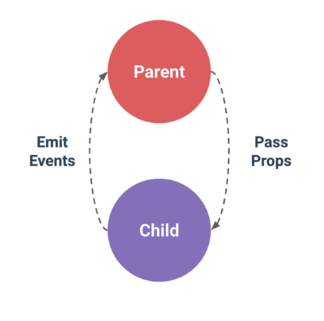

# 02_Pass props & Emit events

> 2020.11.11 오후 라이브

[강의 코드 - Youtube Project](https://lab.ssafy.com/ssafy4/vue/tree/master/01_sfc/youtube-project)


아래의 내용과 라이브 시간에 활용한 코드를 같이 살펴보며 학습하면 됩니다. 😊


## 1. Pass Props & Emit Events

> 이 파트는 반드시 Vue Dev Tools를 사용해서 Props의 흐름 및 이벤트의 발생을 체크해야 한다.

[Vue 컴포넌트의 데이터 단방향 흐름 - 공식문서](https://kr.vuejs.org/v2/guide/components-props.html#%EB%8B%A8%EB%B0%A9%ED%96%A5-%EB%8D%B0%EC%9D%B4%ED%84%B0-%ED%9D%90%EB%A6%84)



**데이터의 중요성**

- 월요일에 살펴본 개념처럼 Front-End Development는 사용자에게 데이터를 보여주고 데이터와 상호 작용하는 과정을 의미한다.
- 이 과정에서 핵심이 되는 것은 data이며 이를 잘 관리하는 것은 매우 중요하다.


**데이터 관리**

- 규모가 작은 웹 어플리케이션을 개발하는 경우 data 관리는 그리 어렵지 않다.
- 하지만 규모가 커지고 그에 따른 컴포넌트의 숫자가 증가하면 어떤 컴포넌트에서 어떤 데이터를 관리하는지 파악하기가 매우 어려워진다. 
- Vue에서는 모든 데이터를 부모와 자식 컴포넌트 사이의 '단방향으로 내려가는 바인딩'의 형태로 관리한다. 
  - 부모의 속성(데이터)가 변경되면 자식 속성에게 '자동'으로 전달된다.
  - 하지만 자식의 속성이 변경되는 것은 자식 속성에게 전달되지 않는다.


**부모 컴포넌트 < -- > 자식 컴포넌트**

1. ***부모 -> 자식 (VideoList -> VideoListItem)***

   - Pass Props(Properties의 줄임말)

     - 데이터를 내려줄 때 `v-bind` 디렉티브를 활용한다. (줄여서 `:`를 많이 사용한다.)
     - `:video="video"`의 형태를 많이 사용하는데 오른쪽은 부모 컴포넌트에서 사용하는 데이터이고 왼쪽은 자식 컴포넌트로 내려 줄 이름을 얘기한다. 

     ```javascript
     // VideoList.vue
     
     <VideoListItem 
     	...
     // 왼쪽의 video는 자식 컴포넌트인 VideoListItem에서 사용 할 이름
     // 오른쪽의 video는 부모 컴포넌트인 VideoList에 있는 video 데이터
         :video="video"
     />
     ```

     ```javascript
     // VideoListItem.vue
     
     export default {
       name: 'VideoListItem', 
       // 부모 컴포넌트(VideoList)로부터 내려온 데이터(video라는 이름으로 내려줌)를 받아서 활용한다.
       props: {
         video: Object,
       },
       ...
     ```

     

2. ***자식 -> 부모(VideoListItem -> VideoList)***

   - Emit Events
     - `this.$emit('사용자가 직접 지정하는 이벤트 이름', 넘길 데이터1, 넘길 데이터2, ...)`
     - 사용자가 지정하는 이벤트는 주로 `kebab-case`의 형태로 작성하며 데이터를 넘기는 것은 넘기는 개수에 제한이 없다. (Dev Tools에서는 넘어가는 데이터를 `payload`라는 이름으로 표현한다.)

   - 자식의 데이터가 변경되어도 부모의 데이터가 변화하지 않는다.

   - 자식은 부모에게 이벤트와 함께 전달하고 싶은 데이터를 함께 넘겨야 한다.

     ````html
     <!-- VideoListItem.vue -->
     
     <template>
       <!-- 1. 태그(아이템)을 클릭하면 selectVideo 메서드가 실행된다. -->
       <li @click="selectVideo">
     	...
       </li>
     </template>
     
     ...
     methods: {
          <!-- 2. select-video라는 이벤트와 함께 해당 video 데이터를 부모 컴포넌트로 올려준다.-->
           selectVideo: function () {
           this.$emit('select-video', this.video)
         }
     },
     ````

     ```html
     <!-- VideoList.vue -->
     
     <template>
       <div>
         <ul>
           <!--1. 자식 컴포넌트(VideoListItem)로부터 올라온 이벤트(select-vdieo)를 듣고 있다가 onVideoSelect 메서드를 실행한다. -->
           <VideoListItem 
     	...
             @select-video="onVideoSelect"
           />
         </ul>
       </div>
     </template>
     
     ...
     methods: {
     	<!-- 메서드가 실행되면 올라온 데이터와 함께 select-video라는 이벤트를 다시 부모 컴포넌트(App)로 올려준다. -->
           onVideoSelect: function (video) {
           this.$emit('select-video', video)
         }
     }
     ```

     


## 2. Youtube Project

### 프로젝트 기본 구조


1. 라이브 시간에 활용한 Youtube 코드를 올려 놓았습니다.
2. 주석을 통해 데이터의 흐름을 파악할 수 있도록 구성하였으니 반드시 어떠한 순서로 데이터가 흘러가는지 고민하며 코드를 작성 해주세요.
3. 위의 프로젝트 구조가 어떤 흐름으로 흘러가는지 번호를 붙여가며 그에 맞는 코드를 작성 해보는 것도 좋은 방법입니다.

